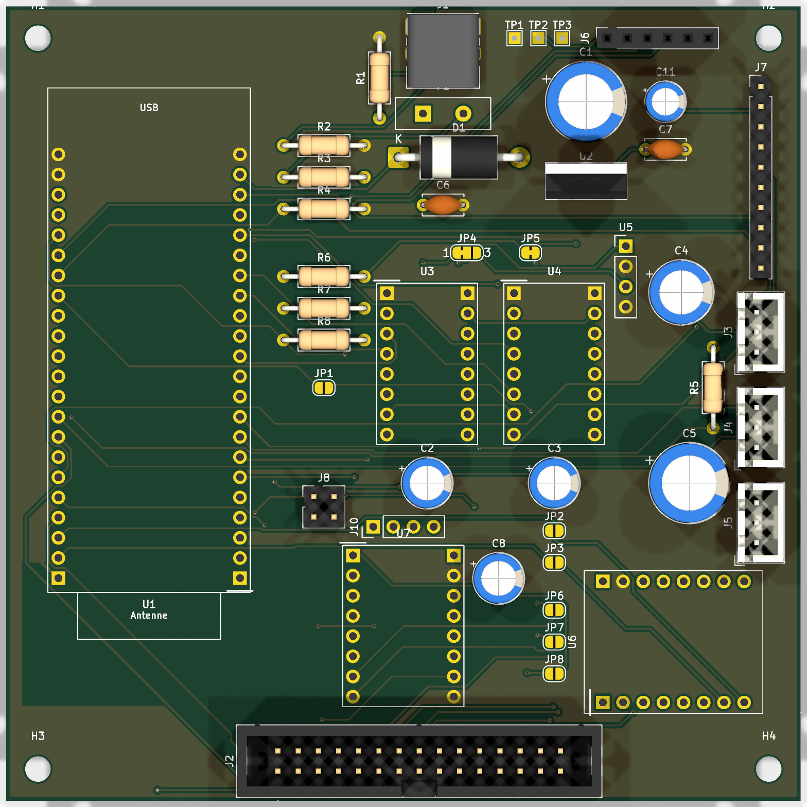
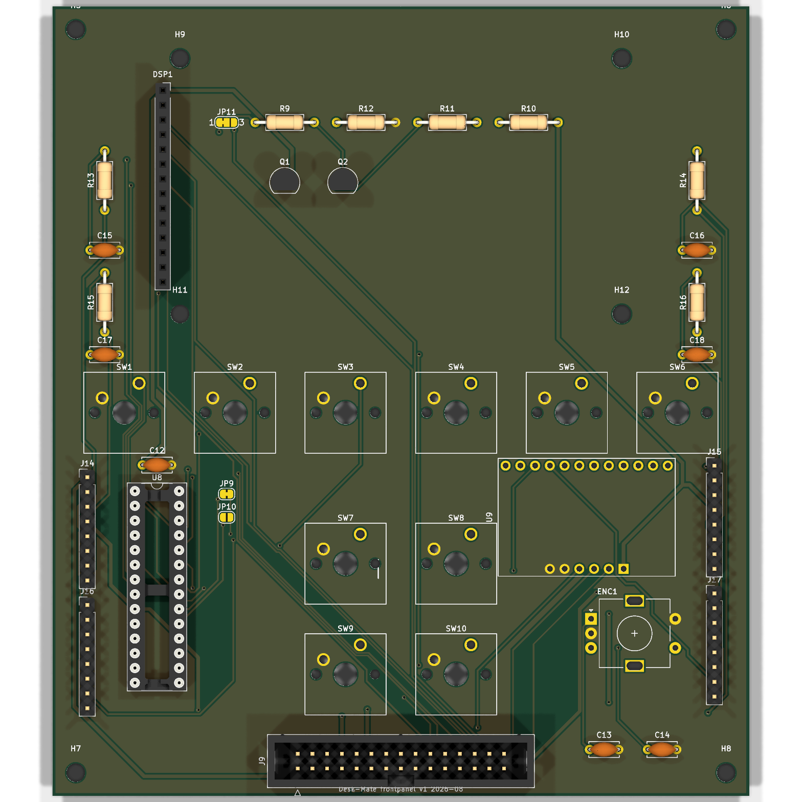
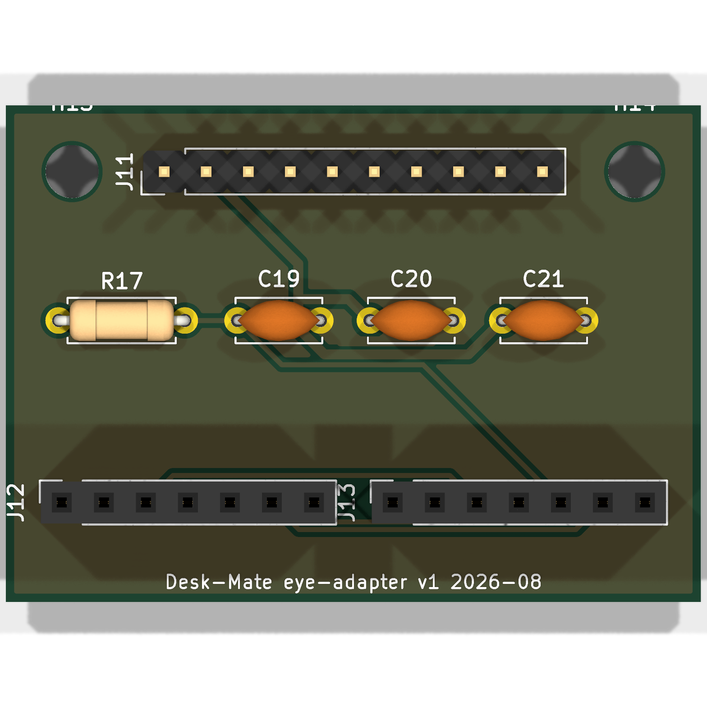

<p align="center"></p>

# Desk-Mate

Ein kleiner Wall-E-artiger Schreibtisch-Begleiter: eine Ampel für alles, was dich braucht (Claude Code, Browser-Downloads, Steam), ein Deck mit Motorfadern und Soft-Keys, ein Kopf mit zwei Augen-Displays. Verbunden per USB, BLE und WiFi; steuerbar vom Mac, vom Handy und über das Haus-MQTT. Alles Through-Hole, alles 3D-gedruckt, alles dokumentiert — inklusive Arbeitszeit.

**Zwischenstand (2026-08-27):**

| Schritt | Stand |
|---|---|
| Design-Spec (18 Grill-Fragen) | ✅ [`docs/superpowers/specs/`](docs/superpowers/specs/2026-08-22-desk-mate-design.md) |
| Pin-Map gegen Datenblatt + DevKit-Schaltplan verifiziert | ✅ [`firmware/arduino/deskmate/pins.h`](firmware/arduino/deskmate/pins.h) |
| Stückliste mit Quellen und Preisen, Teile bestellt (Amazon ~142 €) | ✅ [`hardware/bom.md`](hardware/bom.md) |
| KiCad: Mainboard 100×100 · Frontpanel 120×136 · Augen-Adapter 42×30 — ERC/DRC sauber, Gerber exportiert | ✅ [`hardware/kicad/`](hardware/kicad/README.md) |
| Platinen-Bestellung (JLCPCB) | 🔜 nach Nachmessen der Module + Fader-Charakterisierung |
| Firmware · Agent/App · Gehäuse | ⬜ danach |

Arbeitszeit und Tagesprotokolle: [`vault/Log/`](vault/Log/) · Projektseite: Portfolio-Eintrag P12.

```
 ┌─────────────────────┐
 │ KOPF  (pan/tilt)    │  Augen-Adapter-PCB → 2× GC9A01 (rund, 1,28")
 │                     │  WS2812-Ring (Ampel) · 2× MG90S im Hals
 ├─────────────────────┤
 │ BAUCH / DECK        │  FRONTPANEL-PCB
 │  [ 2,8" ILI9341 ]   │   6 Soft-Keys unter dem Display
 │  [k][k][k][k][k][k] │   4 Makro-Keys · EC11-Encoder
 │  |F| [k][k] (o) |F| │   2(4)× Motorfader MF60T · MCP23017 · MPR121
 │  |F|  [k][k]    |F| │
 ├─────────────────────┤
 │ BASE (statisch)     │  MAINBOARD-PCB
 │  USB-C(D) USB-C(P)  │   ESP32-S3 DevKitC-1 · 2× USB-C · LD1117V33
 │  BME680             │   2(4)× DRV8833 · Reserve: Stepper-Treiber, C3
 └─────────────────────┘
          │ USB / BLE / WiFi-MQTT
   ┌──────┴──────┐      ┌──────────┐      ┌────────────┐
   │ macOS-Agent │◄────►│ iOS-App  │      │ Claude Code│──Hooks──► Agent
   │ (Menüleiste)│ MQTT │          │      └────────────┘
   └─────────────┘      └──────────┘
```

| Pfad | Inhalt |
|---|---|
| `docs/superpowers/specs/` | Design-Spec (die eine Wahrheit für Hardware, Pin-Map, Protokolle) |
| `docs/superpowers/plans/` | Implementierungspläne je Phase |
| `docs/relic/` | Der Ursprungs-Prompt, unverändert |
| [`docs/anleitung/`](docs/anleitung/) | Bauanleitung (wächst mit dem Projekt) |
| `docs/logo/` | Logo (SVG) |
| `vault/` | Obsidian-Vault: Tagesblätter mit Arbeitszeit, Entscheidungen, Bestellungen |
| `hardware/kicad/` | Mainboard, Frontpanel, Augen-Adapter (KiCad 10) |
| `hardware/3d/` | Gehäuse (STEP + STL) |
| `hardware/bom.md` | Stückliste |
| `firmware/arduino/deskmate/` | ESP32-S3-Firmware (arduino-cli) |
| `app/` | macOS-Agent + iOS-App (Swift, XcodeGen) |
| `agent-windows/` | Windows-Tray (Python, Phase 2) |
| `server/` | Vercel-Function für Push |
| `tools/` | Session-Hooks, Secret-Check |

## Hardware

| Mainboard (Base) | Frontpanel (Deck) | Augen-Adapter |
|---|---|---|
|  |  |  |

Drei Through-Hole-Platinen, alle Module gesteckt (ESP32-S3-DevKitC-1, Pololu DRV8833, MPR121, Displays). Schaltpläne als PDF, STEP-Modelle und JLCPCB-Gerber-Zips liegen in `hardware/kicad/<board>/fab/`; Aufbau und Entwurfsregeln in [`hardware/kicad/README.md`](hardware/kicad/README.md), Bestellanleitung in [`docs/anleitung/01-platinen.md`](docs/anleitung/01-platinen.md).

## Bauen

Nach dem Klonen einmalig:

```bash
git config core.hooksPath tools/githooks   # Secret-Check vor jedem Commit
sh tools/test-check-secrets.sh             # muss "OK" sagen
sh tools/test-session-hooks.sh             # muss "OK" sagen
sh tools/test-pins.sh                      # Pin-Map-Regeln
sh tools/test-kicad.sh                     # ERC + DRC + Netzliste (braucht KiCad 10 unter /Applications)
```

KiCad-Dateien neu erzeugen/exportieren: siehe [`hardware/kicad/README.md`](hardware/kicad/README.md). Firmware- und App-Befehle kommen mit den jeweiligen Phasen dazu (siehe `CLAUDE.md`).

## Lizenz

MIT (Code). Lizenz für die Hardware-Dateien wird noch festgelegt.
